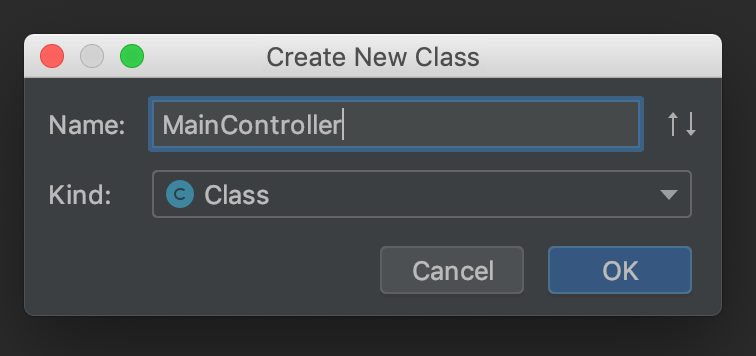

# SpringBootPractice
스프링부트 연습

[TOC]


##### Table of Contents  

[1. 아무것도 없는 스프링 부트 프로젝트 생성](#headers)  
[2. Coltroller 생성하기](#headers1)  
[3. 마이바티스 스프링 부트 프로젝트 생성](#header2)

<a name="headers"/>

# 1. 아무것도 없는 스프링 부트 프로젝트 생성

### 새프로잭트 설정


- Artifact는 대문자는 넣을 수 없다.
- Type에 Gradle Project를 선택한다.
- 다음단계로 이동한다.

### Dependencies 설정


- Dependencies를 선택하는 부분이다.
- 프로잭트를 이미 생성한 후 이부분을 다시 들어가고 싶은데 진입방법을 모르겠음. ㅠㅠ
- 그래서 혹시 이부분을 다시 수정하고 싶을때는 프로잭트를 새로 생성한 후 build.gradle파일에서 dependencies 부분을 가져오도록 하자
- 다음단계로 이동한다

### 프로잭트 설정 마무리


- 프로잭트를 저장할 원하는 경로를 선택 후 Finish를 선택한다.

### 기타 설정 팝업


- 프로잭트가 생성되고 아래와 같은 팝업이 뜬다.
- 잘모르겠어서 그냥 OK

### 프로젝트 빌드


- 프로잭트 생성 후 빌드를 한다. 아래와 같은 결과가 나온다.

<a name="headers1"/>

# 2. Coltroller 생성하기

### 컨트롤러 생성하기
현재 원하는 목표는 API작업을 하는건데, 클라이언트 단에서 url을 호출하면 웹서버에서 해당하는 요청을
처리해줘야 하는 작업을 한다. Controller은 이러한 요청에 대한 처리하는 부분을 명칭하는 것 같으며,
스프링부트쪽에서 @controller이란 어노테이션을 붙여줘야 이게 동작하는 구조로 되어있어 보입니다.(뇌피셜 죄송)



- 컨트롤러에는 @Controller이란 어노테이션을 붙여야한다.
- 안그려면 RequestMapping 후에 url 요청 시 동작하지 않음.

### RequestMapping 추가하기
이 작업을 해주면 드디어 웹에서 호출을 할 수 있게된다.


- 함수를 생성 후 @RequestMapping 어노테이션을 붙여준다.
- 라이브러리를 추가해줘야한다.

### Add spring-boot-starter-web


- 이 해당 라이브러리를 추가하는때부터 빌드 시 웹서버가 작동하는 것 같아보인다.

### 빌드하기


### 빌드결과


- 함수에 @ResponseBody를 처리해줘야한다.

### ResponseBody 추가
 

<a name="header2"/>

# 3. 마이바티스 스프링 부트 프로젝트 생성

http://www.mybatis.org/spring-boot-starter/mybatis-spring-boot-autoconfigure/ 사이트 참조

dependencies 에 마이바티스를 추가

```
dependencies {
    //마이바티스 추가
    implementation 'org.mybatis.spring.boot:mybatis-spring-boot-starter:2.0.1'
    implementation 'org.springframework.boot:spring-boot-starter-web'
    implementation 'org.springframework.boot:spring-boot-starter'
    testImplementation 'org.springframework.boot:spring-boot-starter-test'
}
```

dependencies 추가만 하고 빌드시 아래와 같은 에러가 나옴

```
***************************
APPLICATION FAILED TO START
***************************

Description:

Failed to configure a DataSource: 'url' attribute is not specified and no embedded datasource could be configured.

Reason: Failed to determine a suitable driver class


Action:

Consider the following:
	If you want an embedded database (H2, HSQL or Derby), please put it on the classpath.
	If you have database settings to be loaded from a particular profile you may need to activate it (no profiles are currently active).


Process finished with exit code 1
```

application.properties에 아래와 같이 접속 정보를 설정해줘야한다.

```
spring.datasource.driver-class-name=com.mysql.jdbc.Driver
spring.datasource.url=jdbc:mysql://sarang628.iptime.org:3306/TravelBuddy?characterEncoding=UTF-8&serverTimezone=UTC
spring.datasource.username=travelbuddy
spring.datasource.password=travelbuddy!@#
```

모델생성

```
public class User {
    int user_id;
    String name;

    @Override
    public String toString() {
        return new Gson().toJson(this);
    }
}
```


맵퍼 생성

```
@Mapper
public interface UserMapper {

    @Select("Select * from User")
    ArrayList<User> getAllUsers();
}
```


POST 파라미터 받기

```
@PostMapping("/join")
    public @ResponseBody
    String join(@RequestParam("token") String token) {
        return token;
    }
```


# 스프링 부트 우분투 빌드

우분투 빌드 환경을 구축하는데 4~5일정도 삽질을 한 것 같다.
굉장히 고단한 시간이였다ㅠㅠ 
그래들 빌드하는데 자바 버전 맞추는게 중요했었다. 9버전 이상으로 가니까
가상 머신이 안된(?)다는 오류를 뱉어서 그 외에 여러가지 오류들이 있었는데
고치기 바빠 기록을 할 수 없었다. 중요한건 자바 8버전을 잘 설치해서
실행하면 되는 것 이였다.

```
oracle-java8-installer 패키지를 사용할 수 없습니다.  하지만 다른 패키지가 참조하고 있습니다.
해당 패키지가 누락되었거나 지워졌다는 뜻입니다. 아니면 또 다른 곳에서
패키지를 받아와야 하는 경우일 수도 있습니다.

E: 'oracle-java8-installer' 패키지는 설치할 수 있는 후보가 없습니다

```
```aidl
sudo add-apt-repository ppa:webupd8team/java
```


```aidl
패키지 python-software-properties는 이미 최신 버전입니다 (0.96.20.8).
다음 패키지가 자동으로 설치되었지만 더 이상 필요하지 않습니다:
  ant ant-optional ca-certificates-java default-jre-headless fonts-dejavu-extra java-common java-wrappers junit libactivation-java libantlr-java libaopalliance-java libapache-pom-java libasm-java
  libasm4-java libaspectj-java libass5 libatinject-jsr330-api-java libatk-wrapper-java libatk-wrapper-java-jni libavcodec-ffmpeg-extra56 libavdevice-ffmpeg56 libavfilter-ffmpeg5 libavformat-ffmpeg56
  libavresample-ffmpeg2 libavutil-ffmpeg54 libbcel-java libbcpg-java libbcprov-java libblas-common libbluray1 libbonobo2-0 libbonobo2-common libboost-program-options1.58.0 libboost-thread1.58.0
  libbsf-java libbsh-java libbz2-dev libcapnp-0.5.3 libcdi-api-java libcglib-java libcglib3-java libchromaprint0 libclassworlds-java libcommons-cli-java libcommons-codec-java
  libcommons-collections3-java libcommons-compress-java libcommons-dbcp-java libcommons-httpclient-java libcommons-io-java libcommons-lang-java libcommons-lang3-java libcommons-logging-java
  libcommons-net-java libcommons-net2-java libcommons-parent-java libcommons-pool-java libdom4j-java libdoxia-core-java libecj-java libeclipse-aether-java libeclipse-jdt-core-java libel-api-java
  libexpat1-dev libfelix-osgi-obr-java libgeronimo-annotation-1.3-spec-java libgeronimo-ejb-3.2-spec-java libgeronimo-interceptor-3.0-spec-java libgeronimo-jms-1.1-spec-java
  libgeronimo-jta-1.1-spec-java libgeronimo-validation-1.0-spec-java libgif7 libgnome-2-0 libgnome2-common libgnomevfs2-0 libgnomevfs2-common libgoogle-gson-java libgoogle-perftools4 libgsoap8
  libgtkglext1 libguava-java libguice-java libhamcrest-java libhardware2 libhawtjni-runtime-java libhttpclient-java libhttpcore-java libhybris libhybris-common1 libjansi-java libjansi-native-java
  libjarjar-java libjatl-java libjaxb-api-java libjaxen-java libjaxp1.3-java libjcifs-java libjcip-annotations-java libjcommander-java libjcsp-java libjdepend-java libjdom1-java libjdom2-java
  libjformatstring-java libjline2-java libjna-java libjna-jni libjsch-java libjsoup-java libjsp-api-java libjsr166y-java libjsr305-java libjzlib-java libkryo-java libkxml2-java libllvm4.0 libllvm5.0
  liblog4j1.2-java liblogback-java liblua5.1-0 libmad0 libmail-java libmaven-archiver-java libmaven-parent-java libmaven-resolver-java libmaven-shared-utils-java libmaven2-core-java libmaven3-core-java
  libmedia1 libmimic0 libminlog-java libnative-platform-java libnative-platform-jni libncurses5-dev libnekohtml-java libnetty-3.9-java libobjenesis-java libopencv-calib3d2.4v5 libopencv-contrib2.4v5
  libopencv-core2.4v5 libopencv-features2d2.4v5 libopencv-flann2.4v5 libopencv-highgui2.4v5 libopencv-imgproc2.4v5 libopencv-legacy2.4v5 libopencv-ml2.4v5 libopencv-objdetect2.4v5 libopencv-video2.4v5
  libopenjpeg5 liborbit-2-0 libosgi-annotation-java libosgi-core-java libosgi-foundation-ee-java libpcrecpp0v5 libplexus-ant-factory-java libplexus-archiver-java libplexus-bsh-factory-java
  libplexus-cipher-java libplexus-classworlds-java libplexus-classworlds2-java libplexus-cli-java libplexus-component-annotations-java libplexus-component-metadata-java libplexus-container-default-java
  libplexus-container-default1.5-java libplexus-containers1.5-java libplexus-interactivity-api-java libplexus-interpolation-java libplexus-io-java libplexus-sec-dispatcher-java libplexus-utils-java
  libplexus-utils2-java libpolyglot-maven-java libpostproc-ffmpeg53 libqdox-java libqdox2-java libreflectasm-java librhino-java librpm3 librpmbuild3 librpmio3 librpmsign3 libschroedinger-1.0-0
  libservlet-api-java libservlet3.0-java libservlet3.1-java libsisu-inject-java libsisu-plexus-java libslf4j-java libsnappy-java libsnappy-jni libsodium18 libspring-aop-java libspring-beans-java
  libspring-context-java libspring-core-java libspring-expression-java libspring-instrument-java libsrtp0 libswresample-ffmpeg1 libswscale-ffmpeg3 libtbb2 libtcmalloc-minimal4 libtext-unidecode-perl
  libtinfo-dev libtomcat7-java libtomcat8-java libtomcat9-java libv8-3.14.5 libva1 libwagon-file-java libwagon-ftp-java libwagon-http-java libwagon-http-shaded-java libwagon-java
  libwagon-provider-api-java libwebpdemux1 libwebsocket-api-java libwildmidi1 libx264-148 libx265-79 libxalan2-java libxbean-java libxbean-reflect-java libxerces2-java libxml-commons-external-java
  libxml-commons-resolver1.1-java libxom-java libxpp2-java libxpp3-java libxstream-java libxz-java libyaml-cpp0.5v5 libyaml-snake-java lua-lpeg m4 openjdk-11-jre-headless oxideqt-codecs-extra
  qml-module-qtwebkit ruby2.3 snapd-login-service testng tex-common texinfo xserver-xorg-input-evdev-hwe-16.04 xserver-xorg-input-synaptics-hwe-16.04 xserver-xorg-legacy-hwe-16.04
  xserver-xorg-video-amdgpu-hwe-16.04 xserver-xorg-video-qxl-hwe-16.04 xserver-xorg-video-vesa-hwe-16.04
Use 'sudo apt autoremove' to remove them.
```

```aidl
java

Command 'java' not found, but can be installed with:

sudo apt install default-jre            
sudo apt install openjdk-11-jre-headless
sudo apt install openjdk-8-jre-headless 

```

# ssh 로그인 없이 접속하기
1. rsa 키 생성하기
```
ssh-keygen -t rsa
```
2. .ssh/id_rsa.pub 안에 있는 값을 복사.

3. 원격 서버에 접속 후 .ssh/authorized_keys(없으면 생성) 안에 복사한 값을 넣으면됨
- 이미 등록된게 있는데 그냥 엔터친다음 다음 라인에 붙여넣으니까 잘 동작됬다.

# DB 생성하기
```
MariaDB [(none)]> create database green_cloud
    -> ;
Query OK, 1 row affected (0.00 sec)

MariaDB [(none)]> create user "green_cloud"@"%" identified by "green_cloud!@#"
    -> ;
Query OK, 0 rows affected (0.00 sec)

MariaDB [(none)]> grant all privileges on green_cloud.* to "green_cloud"@"%";
Query OK, 0 rows affected (0.00 sec)
```