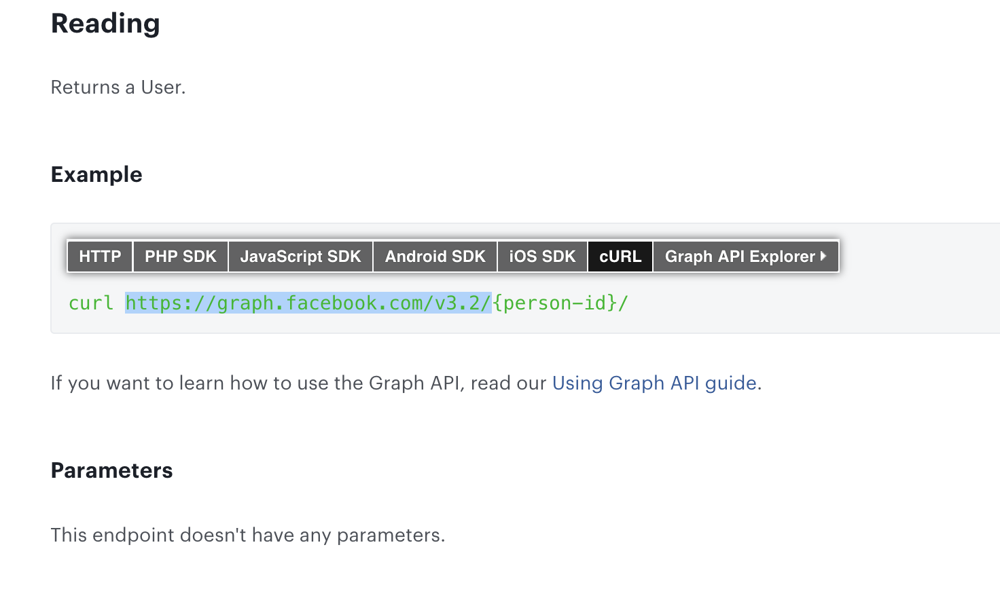
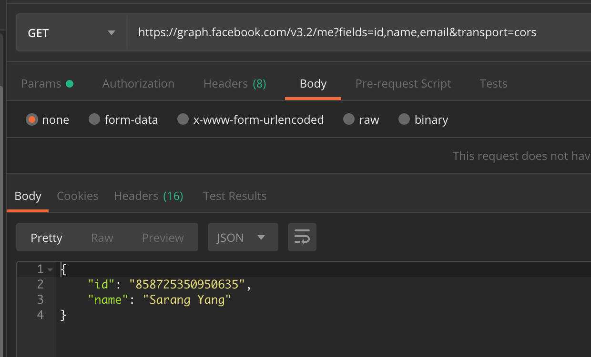

# 페이스북 로그인 서버 작업

## 페이스북 API테스트 주소

<https://developers.facebook.com/tools/explorer/>

페이스북 api사이트를 요리조리 뒤지다보면 아래와 같은 페이지를 찾을 수 있다.

사용자 정보를 가져오기위해선 graph라는 api를 사용해야 하며 해당 api를 테스트 할 수 있도록

웹으로 제공하고있다. 엑세스 토큰까지 생성해서 주므로 사용하기 편리하다.



api 페이지에서 본 정보를 바탕으로 포스트맨으로 테스트해보았다. 쉽게 성공 할 수 있다.
헤더부분에 authorization 속성에 Barer + 토큰을 추가해주시면된다. 

! 주의해야할것 barer 앞을 반드시 대문자로 해줘야한다. 카카오톡은 소문자도 동작을 하는데 페북은 대문자만 동작한다는...

이것때문에 한참 시간을 낭비했다.




## API접속 코드 구현하기

페이스북 접속코드 구현 시 주의해야할 점은 GET으로 호출해야한다는 것이다.

카카오는 GET/POST똑같이 동작을 하지만 페이스북은 POST로 요청했을경우 결과가 제대로 나오지 않았다.

```
private void getFaceBookProfile() throws Exception {
        final String uri = "https://graph.facebook.com/v3.2/me";
        String s = connSnsApi(uri, null);
        LoginModel loginModel = new Gson().fromJson(s, LoginModel.class);
        if (loginModel.getId() == null)
            throw new Exception(s);
        
        //페이스북 아이디를 넣어줘야함
        setFb_id(loginModel.getId());
    }

private String connSnsApi(String uri, MultiValueMap<String, String> parameters) {
        //헤더 추가
        HttpHeaders headers = new HttpHeaders();
        headers.add("Authorization", "Bearer " + token);
        com.hexlant.tb.wallet.common.TBLog.d(token);
        //파라미터 추가
        HttpEntity requestEntity = new HttpEntity("parameters", headers);
        ResponseEntity<String> response = new TBRestTemplete() {
            @Override
            void onError(ClientHttpResponse response) {

            }
        }.exchange(uri, HttpMethod.GET, requestEntity, String.class);
        String result = response.getBody();
        com.hexlant.tb.wallet.common.TBLog.d(result);
        return result;
    }
```


## 페이스북 로그인 모델 만들기

모델을 만들기 전에 페북에서 주는 성공 실패 메시지들을 모아서

분석해야한다.

토큰 만료시

```
{
    "error": {
        "message": "Error validating access token: Session has expired on Tuesday, 30-Apr-19 09:00:00 PDT. The current time is Tuesday, 30-Apr-19 23:55:39 PDT.",
        "type": "OAuthException",
        "code": 190,
        "error_subcode": 463,
        "fbtrace_id": "GWEmiZ5RPxE"
    }
}
```

토큰 없을 시 

```
{
    "error": {
        "message": "An active access token must be used to query information about the current user.",
        "type": "OAuthException",
        "code": 2500,
        "fbtrace_id": "C83PZ/L4Z4m"
    }
}
```

잘못된 형식의 토큰일 경우

```
{
    "error": {
        "message": "The access token could not be decrypted",
        "type": "OAuthException",
        "code": 190,
        "fbtrace_id": "Av2rv7MfQwc"
    }
}
```


올바른 토큰일경우

```
{
    "name": "Sarang Yang",
    "id": "858725350950635"
}
```

위 샘플들을 바탕으로 아래와 같은 모델을 만들었다.

```
public class FBLoginModel {
    private String id;
    private String name;
    private Error error;

    public String getId() { return id; }

    public void setId(String id) { this.id = id; }

    public String getName() { return name; }

    public void setName(String name) { this.name = name; }

    public Error getError() { return error; }

    public void setError(Error error) { this.error = error; }

    private class Error {
        String message;
        String type;
        String code;
        String error_subcode;
        String fbtrace_id;

        public String getMessage() { return message; }

        public void setMessage(String message) { this.message = message; }

        public String getType() { return type; }

        public void setType(String type) { this.type = type; }

        public String getCode() { return code; }

        public void setCode(String code) { this.code = code; }

        public String getError_subcode() { return error_subcode; }

        public void setError_subcode(String error_subcode) { this.error_subcode = error_subcode; }

        public String getFbtrace_id() { return fbtrace_id; }

        public void setFbtrace_id(String fbtrace_id) { this.fbtrace_id = fbtrace_id; }
    }
}
```


## 에러 테스트

```
@RunWith(SpringRunner.class)
@SpringBootTest
public class FbLoginTests {

    String tokenExpriedDummy = "{\n" +
            "    \"error\": {\n" +
            "        \"message\": \"Error validating access token: Session has expired on Tuesday, 30-Apr-19 09:00:00 PDT. The current time is Tuesday, 30-Apr-19 23:55:39 PDT.\",\n" +
            "        \"type\": \"OAuthException\",\n" +
            "        \"code\": 190,\n" +
            "        \"error_subcode\": 463,\n" +
            "        \"fbtrace_id\": \"GWEmiZ5RPxE\"\n" +
            "    }\n" +
            "}";

    @Test
    public void test() {
        System.out.println("------ Facebook Login Test ------");

        System.out.println(tokenExpried);

        FBLoginModel fbLoginTests = new Gson().fromJson(tokenExpried, FBLoginModel.class);

        //에러가 있다면
        if(fbLoginTests.getError() != null){
            System.out.println(fbLoginTests.getError().getMessage());
        }

    }
```

