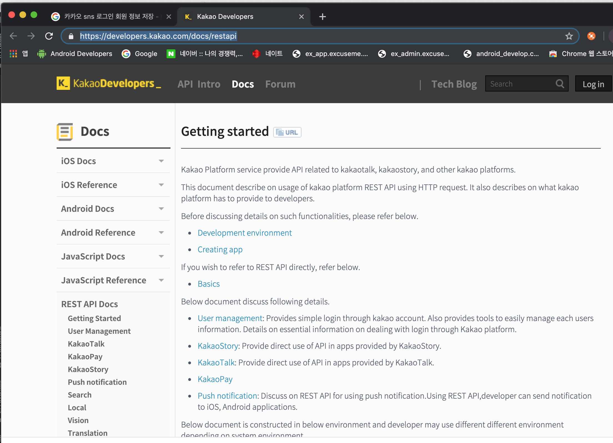

# 카카오 서버 로그인 구현

https://developers.kakao.com/docs/restapi

들어가자마자 숨이 막히는 페이지. REST API Docs를 천천히 살펴보도록 하자.

프로필쪽 API만 보면될 줄 알았는데. 이메일이 없어졌다고 한다. 이정보가지고는 회원 가입을 시킬 수 없다. 문서를 계속 뒤져보자.

Rest Api Tool 메뉴에서 찾았다. /v2/user/me를 호출해보면 사용자의 id를 얻을 수 있다. 카카오는 사용자 키값을 id로 해야할 것 같다.

아이디를 키값으로 하면 카카로 로그인 처리 성공

아이디 외에는 필수값이 없기때문에 회원 가입후 추가 정보부분은 상황에 맞게 처리하기